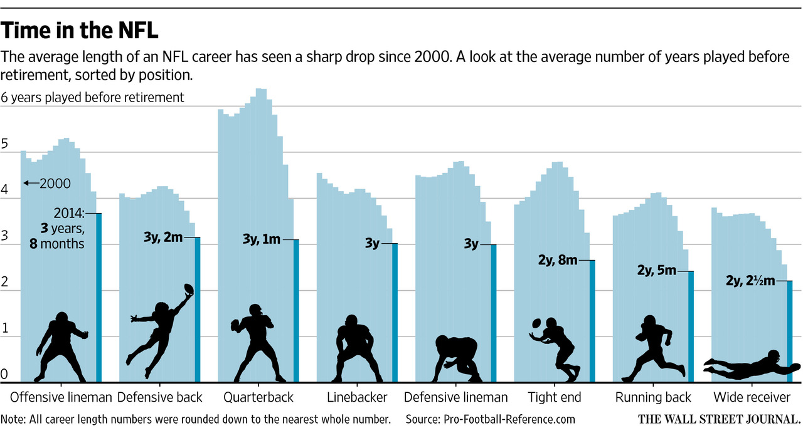

```{r}
setwd('/home/ryan/sports/nfl-life-death/')
```

```{r, warning=FALSE, message=FALSE}
library('tidyverse')
library('zoo')
```

# Data import and cleaning

Bring in all the player data from [pro-football-reference.com](https://www.pro-football-reference.com/players/A/)
```{r, messages=FALSE}
careers <- read_csv('data/nfl-players.csv')
head(careers)
```

Unfurl the data into separate rows for each position listed

```{r}
allpositions <- careers %>% 
  select(name, srid, active, positions, start, end) %>% 
  replace_na(list(positions = '')) %>% 
  mutate(positions = str_replace(positions, ',|/', '-')) %>% 
  separate_rows(positions, sep = '-')
head(allpositions)
```

What positions exist over time?

```{r, fig.align='center'}
ggplot(data = allpositions) +
  geom_bar(mapping = aes(x = start))
```
```{r}
allpositions %>% 
  group_by(start) %>% 
  count() %>% 
  arrange(desc(n)) %>% 
  head()
```

Why the bump in 1987? [Strike season!](https://en.wikipedia.org/wiki/1987_NFL_season)

What positions exist at what times?

```{r, fig.align='center', fig.height=11, fig.width=8}
ggplot(data = allpositions) +
  geom_bar(mapping = aes(x = start)) +
  facet_grid(positions ~ .) +
  theme(axis.text.y = element_blank(),
        axis.ticks.y = element_blank())
```

There are a lot of "backs" (wing backs, blocking backs, etc.) in earlier years that are probably not worth including now.

PFR links: [positions](https://www.pro-football-reference.com/about/positions.htm) [glossary](https://www.pro-football-reference.com/about/glossary.htm)

Spit out the positions so I can classify them

```{r}
posfreq <- allpositions %>% 
  count(positions)
write_csv(posfreq, 'data/positions.csv')
```

Bring in the "simple" positions

```{r}
simplepos <- read_csv('data/positions-categorized.csv')
knitr::kable(simplepos %>% arrange(category, desc(n)))
```

Join the simple positions back to the data
```{r}
allpositions <- allpositions %>%
  left_join(simplepos %>% filter(!is.na(category)) %>% select(positions, category)) %>% 
  replace_na(list(category = 'other'))
```

Now chart positions over time
```{r, fig.align='center', fig.height=11, fig.width=8}
ggplot(data = allpositions) +
  geom_bar(mapping = aes(x = start)) +
  facet_grid(category ~ .) +
  theme(axis.text.y = element_blank(),
        axis.ticks.y = element_blank())
```
Very little of "other" in recent years

Let's filter down to "retired" players (where active is False, according to PFR)
```{r}
retired <- allpositions %>% 
  filter(active == "False" & category != 'other') %>% 
  mutate(career = (end - start))
```

Now calculate raw average for each position in each year and plot it
```{r, fig.align='center', fig.width=10}

# lining it up to match WSJ plot
retired$category <- factor(
  x = retired$category,
  levels = c('offline','defback','quarterback','linebacker','defline','tightend','runback','widerec')
)

careers.by.pos <- retired %>% 
  group_by(category, end) %>% 
  summarise(avgcareer = mean(career))

ggplot(data = careers.by.pos) +
  geom_bar(mapping = aes(x = end, y = avgcareer), stat = 'identity') +
  facet_grid(. ~ category) +
  scale_x_continuous(limits = c(2000, 2014))
```

There is some noise. Will a moving average smooth it out?

```{r, fig.align='center', fig.width=10}

window <- 5 # years

run.careers.by.pos <- retired %>%
  group_by(category, end) %>% 
  summarise(careers = sum(career),
            players = n()) %>% 
  arrange(category, end) %>% 
  group_by(category) %>% 
  mutate(sumcareers = rollsumr(careers, k = window, na.pad = TRUE),
         sumplayers = rollsumr(players, k = window, na.pad = TRUE),
         runavgcareer = sumcareers / sumplayers)

ggplot(data = run.careers.by.pos) +
  geom_bar(mapping = aes(x = end, y = runavgcareer), stat = 'identity') +
  facet_grid(. ~ category) +
  scale_x_continuous(limits = c(2000, 2014))
```

```{r echo=FALSE, out.width='100%'}

```